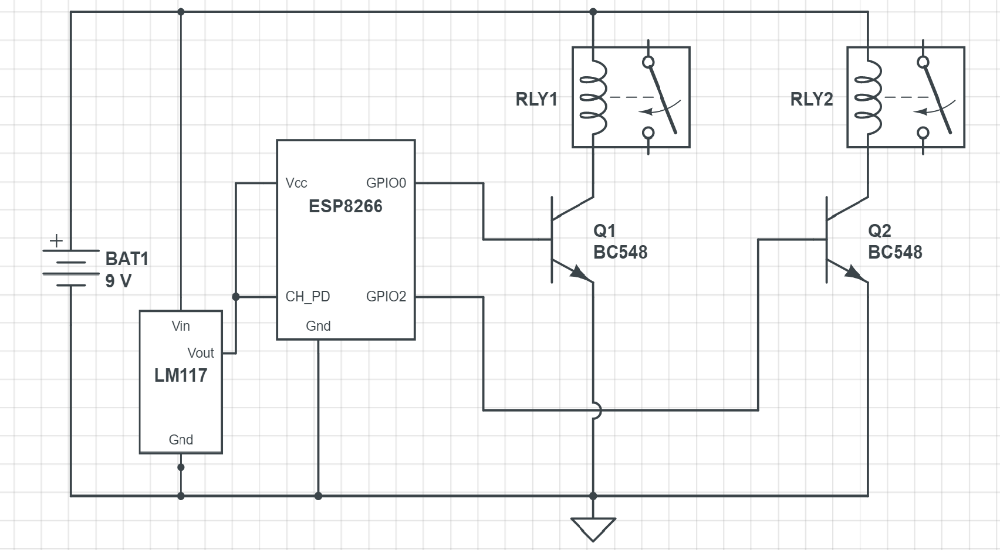

# Iot-device-control
The project aims to control general house hold appliances through a local network.
It can also be outsourced by calling the server url from any kind of medium connected to the home network.

The code that should be dumped in ESP8266 module is in [here](https://github.com/perseus784/Iot-device-control/Home_prog.ino).

Build a simple relay circuit which can be triggered by **3.3v** as ESP8266 can give only a 3.3v triggering signal.

**Basic Circuit**

Use a LM117 voltage regulator to supply 3.3v to ESP8266. The circuit provided is just a simplified example block. To make the circuit more solid it is necessary to take adequate measures like addind swithces, pull down resistors.

Once the circuit is built, The relay terminals should be parallely connected with the real switches that goes to your appliance.
Now, switch on the circuit. Go the server page from your browser that is connected to the home network eg:*10.0.0.20*

Now the webpage loads buttons which takes similar actions. This *URL* can be called by using any means like mobile browser, custom app, automated programs.
